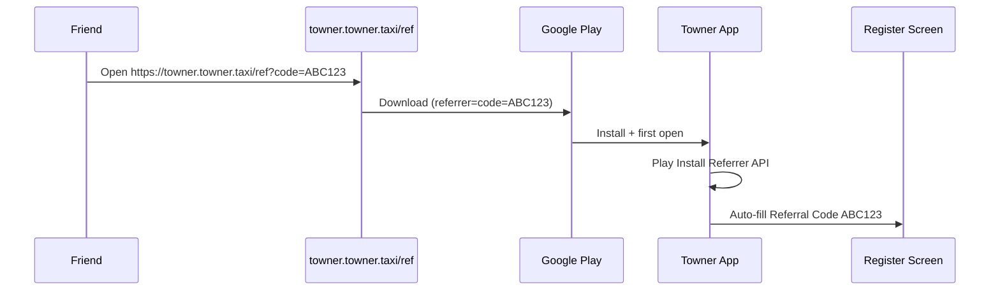

# Referral install attribution

This document explains how referral codes flow from a shared link to the registration screen, and what you must configure for production.

## Architecture



| Scenario | Mechanism |
|----------|-----------|
| New install via landing page | [Play Install Referrer](https://developer.android.com/google/play/installreferrer) (`play_install_referrer`) |
| App already installed | Android App Links / custom scheme (`app_links`) |
| Direct Play Store install | No code (field stays empty) |
| Reinstall without new link | Referrer usually empty; user can type code |
| After successful registration | Pending code cleared (`referral_submitted`) |

## App code map

| File | Role |
|------|------|
| `lib/core/referral/referral_constants.dart` | Domain, package id, URL builders |
| `lib/core/referral/referral_code_parser.dart` | Parse & validate codes |
| `lib/core/services/referral_attribution_service.dart` | Capture + persistence |
| `lib/main.dart` | Initializes service at startup |
| `lib/features/authentication/.../register_screen.dart` | Shows auto-filled code |
| `web/referral/index.html` | Static fallback (optional; Next.js `/ref` is primary) |
| `app/(routes)/ref/` | Next.js referral landing (`/ref?code=…`) |
| `lib/referral.ts` | Code validation + Play Store referrer URL |

## Production setup (step by step)

### 1. Choose and configure the landing domain

1. Point DNS for **`refer.towner.in`** (or your host) to static hosting (Firebase Hosting, Cloudflare Pages, S3, Nginx, etc.).
2. If you use a different host, update `referralLandingHost` in `lib/core/referral/referral_constants.dart` and the `android:host` in `AndroidManifest.xml` to match.

### 2. Deploy the landing page

This Next.js site serves the referral flow at **`/ref`**:

- `https://<your-domain>/ref?code=ABC123` — invite UI + auto-redirect to Play Store with Install Referrer after 3s.
- `https://<your-domain>/.well-known/assetlinks.json` — Android App Links (replace SHA-256 in `public/.well-known/assetlinks.json`).

You can still host `web/referral/index.html` on a dedicated subdomain if needed; keep `referralLandingHost` in Flutter aligned with the host users open.

Example referral link:

```
https://refer.towner.in/ref?code=ABC123
```

### 3. Android App Links verification

1. Get your **release** signing certificate SHA-256 fingerprint:

```bash
keytool -list -v -keystore /path/to/your-release.keystore -alias your_alias
```

2. Replace placeholders in `web/referral/.well-known/assetlinks.json`.
3. Redeploy `assetlinks.json`.
4. Verify in [Google Digital Asset Links](https://developers.google.com/digital-asset-links/tools/generator) or:

```bash
adb shell pm get-app-links com.towner.app
```

Status should show `refer.towner.in` as **verified**.

### 4. Test the full Android flow

1. Uninstall the app (or use a device that never installed it).
2. Open `https://refer.towner.in/ref?code=TESTCODE` in Chrome.
3. Tap **Download App** → install from Play Store (internal testing track is fine).
4. Open the app → go to **Register**.
5. Confirm **Referral code** shows `TESTCODE` and the green “applied from invite link” hint.

**Debug without a domain:** use adb:

```bash
adb shell am start -a android.intent.action.VIEW \
  -d "towner://ref?code=TESTCODE" com.towner.app
```

### 5. Update invite share copy

Invite friends now shares both code and landing URL (`invite_friends.share.message` in `assets/lang/en.json`).

### 6. Backend validation

The app sends `referralCode` on OTP verification. Your API should:

- Validate the code exists and is active.
- Reject invalid codes with a clear error (the app shows the server message).
- Idempotently handle duplicate submissions.

### 7. iOS note

Play Install Referrer is **Android-only**. For iOS App Store installs you need a separate strategy (e.g. App Store campaign links, clipboard on landing page, or a paid deferred deep-link provider). App Links still work when the app is already installed if you add Associated Domains in Xcode.

## Changing the domain later

1. `referral_constants.dart` → `referralLandingHost`
2. `AndroidManifest.xml` → intent-filter `android:host`
3. Redeploy landing + `assetlinks.json` on the new host
4. Ship a new app build if the manifest host changed

## Troubleshooting

| Symptom | Check |
|---------|--------|
| Code not auto-filled after install | User must tap Download on **your** landing page (not search Play manually). Referrer is set only via `&referrer=` on the Play URL. |
| Deep link opens browser, not app | `assetlinks.json` not deployed or wrong SHA-256 fingerprint |
| Code filled on emulator without Play | Use `towner://ref?code=…` adb intent or internal Play testing |
| Old code after reinstall | Expected if Play returns no new referrer; user can edit the field |
